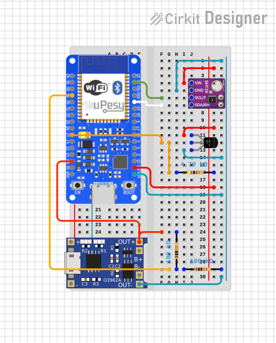

# Hardware Reference

This document is the source of truth for the initial hardware architecture and
pin assignments.

## Current Components

| Component               | Role                                | Interface                                      |
| ----------------------- | ----------------------------------- | ---------------------------------------------- |
| uPesy ESP32 WROOM board | Main MCU and radio module           | ESP32 GPIO, 3.3 V logic                        |
| SHT31                   | Air temperature and humidity sensor | I2C                                            |
| DS18B20                 | External temperature sensor         | OneWire                                        |
| Battery supply          | Planned autonomous power source     | Board power input through regulator/protection |
| Battery voltage divider | Battery voltage measurement         | ADC input                                      |

## Power Architecture

During development, the board is powered from USB. The USB 5 V input feeds the
board regulator, which provides the 3.3 V rail used by the ESP32 and sensors.

For battery operation, the battery path must include the required protection,
charging, and voltage regulation stages for the selected cell and board input.
The ESP32 GPIOs and all sensor signal lines remain 3.3 V only. Do not connect a
battery or 5 V rail directly to any ESP32 GPIO.

Battery monitoring uses a resistor divider between the battery positive terminal
and GND. The divider output goes to the ADC pin and must stay below 3.3 V at the
maximum battery voltage.

## Pin Mapping

The table below lists the ESP32 pins currently used or reserved by the project.

| ESP32 GPIO      | Project usage              | Connected signal/component | Direction | Notes                                                                                             |
| --------------- | -------------------------- | -------------------------- | --------- | ------------------------------------------------------------------------------------------------- |
| GPIO21          | I2C SDA                    | SHT31 SDA                  | I/O       | Standard ESP32 I2C data pin. Pull up to 3.3 V if the breakout does not already include pull-ups.  |
| GPIO22          | I2C SCL                    | SHT31 SCL                  | Output    | Standard ESP32 I2C clock pin. Pull up to 3.3 V if the breakout does not already include pull-ups. |
| GPIO27          | OneWire bus                | DS18B20 DATA               | I/O       | Use a 4.7 kOhm pull-up to 3.3 V on the data line.                                                 |
| GPIO34 / ADC1_6 | Battery voltage monitoring | Battery divider midpoint   | Input     | Input-only ADC1 pin. The divider output must stay below 3.3 V.                                    |

SHT31 uses I2C address `0x44` by default. If the sensor address pin is tied high,
the address may become `0x45`; update firmware and documentation together if
that changes.

## Reserved And Avoided Pins

| ESP32 pins                                 | Status                       | Reason                                                                                                  |
| ------------------------------------------ | ---------------------------- | ------------------------------------------------------------------------------------------------------- |
| GPIO6 to GPIO11                            | Avoid                        | Connected to the ESP32 module flash. Do not use for external wiring.                                    |
| GPIO0, GPIO2, GPIO4, GPIO5, GPIO12, GPIO15 | Avoid unless required        | Boot strapping pins. External pull-ups, pull-downs, or loads can prevent normal boot.                   |
| GPIO1, GPIO3                               | Reserved                     | UART0 programming and serial logs. Keep available for flashing and debugging.                           |
| GPIO34 to GPIO39                           | Input-only                   | Suitable for ADC or digital input only. They cannot drive outputs and do not provide internal pull-ups. |
| ADC2 pins                                  | Avoid for battery monitoring | ADC2 conflicts with Wi-Fi on ESP32. Use an ADC1 pin for battery voltage measurement.                    |
| GPIO21, GPIO22                             | Reserved by project          | SHT31 I2C bus.                                                                                          |
| GPIO27                                     | Reserved by project          | DS18B20 OneWire bus.                                                                                    |
| GPIO34                                     | Reserved by project          | Battery voltage measurement through the resistor divider.                                               |

## Wiring Diagram

## Wiring Notes

- Connect all component grounds together.
- Power SHT31 from 3.3 V, not 5 V.
- Power the DS18B20 from 3.3 V for 3.3 V OneWire signaling.
- Add a 4.7 kOhm pull-up from DS18B20 data to 3.3 V.
- Ensure I2C pull-ups are to 3.3 V. Many SHT31 breakout boards already include them.
- Scale the battery divider so `GPIO34` never exceeds 3.3 V.
- Divider is composed of two 100 kOhm resistors in series for a 2:1 ratio.
